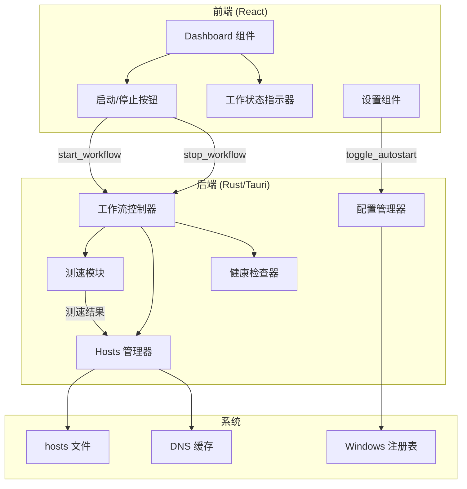

# 设计文档

## 概述

本设计文档描述 anyFAST 应用简化改造的技术实现方案。主要改动包括：
1. 前端 Dashboard 组件简化，移除冗余按钮，添加启动/停止切换按钮
2. 后端添加统一的工作流控制命令
3. Windows 安装程序配置开机自启动
4. 添加工作状态视觉反馈动画

## 架构



## 组件和接口

### 1. 前端组件

#### 1.1 Dashboard 组件修改

移除以下元素：
- `onApplyAll` 按钮（一键全部应用）
- `onClearBindings` 按钮（清除绑定）

添加以下元素：
- `ToggleButton` 组件 - 启动/停止切换按钮
- `WorkingIndicator` 组件 - 工作状态指示器

```typescript
interface DashboardProps {
  endpoints: Endpoint[]
  results: EndpointResult[]
  isWorking: boolean  // 新增：工作状态
  progress: Progress
  bindingCount: number
  healthStatus?: EndpointHealth[]
  onToggleWorkflow: () => void  // 新增：切换工作流
  onApply: (result: EndpointResult) => void
  onEndpointsChange?: (endpoints: Endpoint[]) => void
  onSaveConfig?: (endpoints: Endpoint[]) => void
}
```

#### 1.2 ToggleButton 组件

```typescript
interface ToggleButtonProps {
  isWorking: boolean
  isLoading: boolean
  disabled: boolean
  onClick: () => void
}
```

#### 1.3 WorkingIndicator 组件

```typescript
interface WorkingIndicatorProps {
  isWorking: boolean
  bindingCount: number
}
```

### 2. 后端命令

#### 2.1 新增 Tauri 命令

```rust
/// 启动工作流：测速 + 应用 + 启动健康检查
#[tauri::command]
async fn start_workflow(state: State<'_, AppState>, app_handle: AppHandle) -> Result<WorkflowResult, String>

/// 停止工作流：停止健康检查 + 清除 hosts
#[tauri::command]
async fn stop_workflow(state: State<'_, AppState>) -> Result<u32, String>

/// 获取工作流状态
#[tauri::command]
async fn is_workflow_running(state: State<'_, AppState>) -> Result<bool, String>

/// 设置开机自启动
#[tauri::command]
async fn set_autostart(enabled: bool) -> Result<(), String>

/// 获取开机自启动状态
#[tauri::command]
async fn get_autostart() -> Result<bool, String>
```

#### 2.2 WorkflowResult 数据结构

```rust
#[derive(Debug, Clone, Serialize, Deserialize)]
pub struct WorkflowResult {
    pub test_count: u32,        // 测试的端点数
    pub success_count: u32,     // 成功的端点数
    pub applied_count: u32,     // 应用的绑定数
    pub results: Vec<EndpointResult>,
}
```

### 3. 配置扩展

#### 3.1 AppConfig 扩展

```rust
pub struct AppConfig {
    // ... 现有字段
    #[serde(default = "default_autostart")]
    pub autostart: bool,  // 开机自启动
}

fn default_autostart() -> bool {
    false
}
```

### 4. Windows 自启动实现

使用 Windows 注册表实现开机自启动：

```rust
// 注册表路径
const AUTOSTART_KEY: &str = r"SOFTWARE\Microsoft\Windows\CurrentVersion\Run";
const APP_NAME: &str = "anyFAST";

fn set_autostart_registry(enabled: bool) -> Result<(), String> {
    // 使用 winreg crate 操作注册表
}
```

## 数据模型

### 前端类型扩展

```typescript
// types/index.ts 新增
export interface WorkflowResult {
  testCount: number
  successCount: number
  appliedCount: number
  results: EndpointResult[]
}

// AppConfig 扩展
export interface AppConfig {
  // ... 现有字段
  autostart: boolean  // 开机自启动
}
```

### 后端模型扩展

```rust
// models.rs 新增
#[derive(Debug, Clone, Serialize, Deserialize)]
#[serde(rename_all = "camelCase")]
pub struct WorkflowResult {
    pub test_count: u32,
    pub success_count: u32,
    pub applied_count: u32,
    pub results: Vec<EndpointResult>,
}
```


## 正确性属性

*正确性属性是应该在系统所有有效执行中保持为真的特征或行为——本质上是关于系统应该做什么的形式化陈述。属性作为人类可读规范和机器可验证正确性保证之间的桥梁。*

### Property 1: 按钮状态与显示一致性

*对于任意* 工作状态（isWorking），切换按钮的显示文字和图标应与状态一致：
- 当 isWorking 为 false 时，显示"启动"文字
- 当 isWorking 为 true 时，显示"停止"文字

**Validates: Requirements 2.4, 2.5**

### Property 2: 工作状态与视觉样式一致性

*对于任意* 工作状态（isWorking），视觉指示器的样式应与状态一致：
- 当 isWorking 为 true 时，应用脉冲动画 CSS 类
- 当 isWorking 为 false 时，移除脉冲动画 CSS 类

**Validates: Requirements 5.1, 5.2, 5.3**

### Property 3: 启动工作流完整性

*对于任意* 启用的端点列表，调用 start_workflow 后：
- 所有启用的端点都应被测速
- 所有成功测试的端点的最优 IP 应被写入 hosts 文件
- 返回的 applied_count 应等于实际写入的绑定数

**Validates: Requirements 3.1, 3.2**

### Property 4: 停止工作流完整性

*对于任意* 运行中的工作流状态，调用 stop_workflow 后：
- 健康检查任务应停止（is_workflow_running 返回 false）
- 所有 anyFAST 管理的 hosts 绑定应被清除
- 返回的清除数应等于之前的绑定数

**Validates: Requirements 4.1, 4.2**

### Property 5: 自启动配置持久化

*对于任意* autostart 配置值，设置后重新读取应返回相同的值（round-trip）

**Validates: Requirements 1.3**

## 错误处理

### 测速错误

- 网络超时：显示"测速超时，请检查网络连接"
- 无启用端点：显示"没有启用的端点，请先添加"
- 权限错误：显示管理员权限对话框

### Hosts 操作错误

- 权限不足：提示用户以管理员身份重启
- 文件锁定：重试 3 次后显示错误

### 自启动配置错误

- 注册表访问失败：显示错误提示，不影响其他功能

## 测试策略

### 单元测试

1. **ToggleButton 组件测试**
   - 测试不同状态下的渲染
   - 测试点击事件触发

2. **WorkingIndicator 组件测试**
   - 测试动画类的应用
   - 测试状态文字显示

3. **后端命令测试**
   - 测试 start_workflow 的返回值
   - 测试 stop_workflow 的清除行为
   - 测试 autostart 配置的读写

### 属性测试

使用 fast-check (前端) 和 proptest (后端) 进行属性测试：

1. **Property 1 测试**: 生成随机 isWorking 状态，验证按钮文字
2. **Property 2 测试**: 生成随机 isWorking 状态，验证 CSS 类
3. **Property 3 测试**: 生成随机端点列表，验证工作流完整性
4. **Property 4 测试**: 生成随机绑定状态，验证停止行为
5. **Property 5 测试**: 生成随机 autostart 值，验证 round-trip

每个属性测试至少运行 100 次迭代。

### 集成测试

1. 完整工作流测试：启动 → 测速 → 应用 → 停止 → 清除
2. 错误恢复测试：模拟各种错误场景
