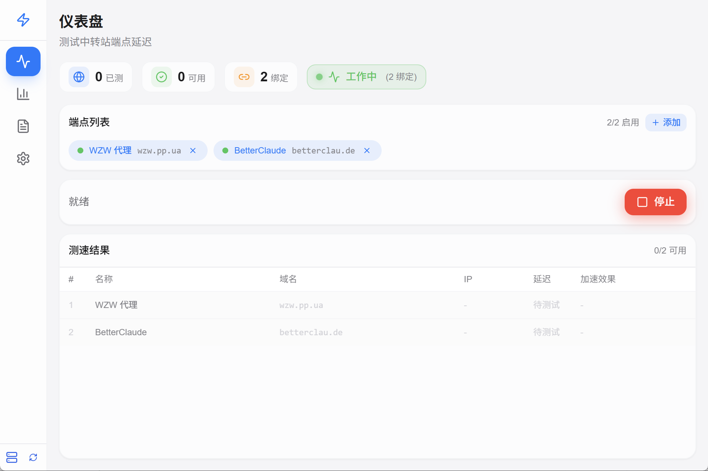

# 实现计划：简化工作流

## 概述

本实现计划将 anyFAST 应用改造为简化的启动/停止工作流模式，包括前端界面简化、后端工作流命令实现、Windows 自启动配置和视觉反馈效果。

## 任务

- [x] 1. 后端工作流命令实现
  - [x] 1.1 添加 WorkflowResult 数据模型
    - 在 `models.rs` 中添加 WorkflowResult 结构体
    - 添加 autostart 字段到 AppConfig
    - _Requirements: 3.1, 3.2_
  
  - [x] 1.2 实现 start_workflow 命令
    - 在 `lib.rs` 中实现测速 + 应用 + 启动健康检查的组合命令
    - 复用现有的 start_speed_test 和 apply_all_endpoints 逻辑
    - _Requirements: 3.1, 3.2, 3.3_
  
  - [x] 1.3 实现 stop_workflow 命令
    - 停止健康检查任务
    - 清除所有 hosts 绑定
    - 刷新 DNS 缓存
    - _Requirements: 4.1, 4.2, 4.3_
  
  - [x] 1.4 实现 is_workflow_running 命令
    - 返回当前工作流运行状态
    - _Requirements: 5.4_

- [x] 2. Windows 自启动功能实现
  - [x] 2.1 添加 winreg 依赖并实现注册表操作
    - 在 Cargo.toml 添加 winreg 依赖
    - 实现 set_autostart 和 get_autostart 命令
    - _Requirements: 1.3_
  
  - [x] 2.2 配置 NSIS 安装程序自启动选项
    - 修改 `nsis/installer.nsh` 添加自启动注册表项
    - _Requirements: 1.1, 1.2_

- [x] 3. 检查点 - 确保后端编译通过
  - 确保所有测试通过，如有问题请询问用户。

- [x] 4. 前端类型和状态管理
  - [x] 4.1 更新 TypeScript 类型定义
    - 在 `types/index.ts` 添加 WorkflowResult 接口
    - 更新 AppConfig 接口添加 autostart 字段
    - _Requirements: 3.1, 3.2_
  
  - [x] 4.2 更新 App.tsx 状态管理
    - 添加 isWorking 状态
    - 添加 toggleWorkflow 处理函数
    - 移除 applyAll 和 clearBindings 相关代码
    - _Requirements: 2.1, 2.2, 3.1, 4.1_

- [x] 5. Dashboard 组件改造
  - [x] 5.1 移除冗余按钮
    - 删除"一键全部应用"按钮
    - 删除"清除绑定"按钮
    - 更新 DashboardProps 接口
    - _Requirements: 2.1, 2.2_
  
  - [x] 5.2 实现 ToggleButton 组件
    - 创建启动/停止切换按钮
    - 根据 isWorking 状态显示不同文字和图标
    - _Requirements: 2.3, 2.4, 2.5_
  
  - [x] 5.3 实现 WorkingIndicator 组件
    - 创建工作状态指示器
    - 添加脉冲动画效果
    - _Requirements: 5.1, 5.2, 5.3, 5.4_
  
  - [x] 5.4 编写属性测试 - 按钮状态一致性
    - **Property 1: 按钮状态与显示一致性**
    - 使用 fast-check 生成随机 isWorking 状态
    - 验证按钮文字与状态一致
    - **Validates: Requirements 2.4, 2.5**
  
  - [x] 5.5 编写属性测试 - 视觉样式一致性
    - **Property 2: 工作状态与视觉样式一致性**
    - 使用 fast-check 生成随机 isWorking 状态
    - 验证 CSS 类与状态一致
    - **Validates: Requirements 5.1, 5.2, 5.3**

- [x] 6. Settings 组件更新
  - [x] 6.1 添加自启动设置选项
    - 在设置界面添加开机自启动开关
    - 调用 set_autostart/get_autostart 命令
    - _Requirements: 1.3_

- [x] 7. 检查点 - 确保前端编译通过
  - 确保所有测试通过，如有问题请询问用户。

- [x] 8. 集成和样式优化
  - [x] 8.1 添加 CSS 动画样式
    - 在 `index.css` 添加脉冲动画 keyframes
    - 添加工作状态相关样式类
    - _Requirements: 5.1, 5.2, 5.3_
  
  - [x] 8.2 整合所有组件
    - 确保 Dashboard 正确传递 props
    - 验证状态流转正确
    - _Requirements: 2.3, 3.1, 4.1_

- [x] 9. 最终检查点 - 确保所有测试通过
  - 确保所有测试通过，如有问题请询问用户。

## 备注

- 所有任务都是必需的，包括属性测试
- 每个任务都引用了具体的需求以便追溯
- 检查点确保增量验证
- 属性测试使用 fast-check (前端) 验证正确性属性
- 实现过程中使用谷歌搜索获取最新技术信息
