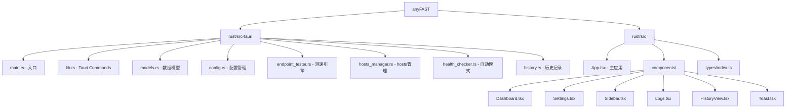

# anyrouter FAST

> 中转站端点优选工具 - 自动测速、智能切换、hosts 绑定

## 变更记录 (Changelog)

### 2026-01-28 13:16:12
- **文档同步更新**：
  - 确认 Tauri Commands 实际数量为 24 个
  - 补充 `check_for_update`, `get_current_version`, `restart_as_admin` 命令说明
  - 补充 Service 模块 RPC 方法说明

### 2026-01-28 07:50:00
- **新增 Windows Service 架构**：
  - 添加独立的 `anyfast-service` Windows 服务，以 SYSTEM 权限管理 hosts 文件
  - GUI 应用可以普通用户权限运行，通过 Named Pipe 与 Service 通信
  - 安装时一次性注册 Service，日常使用无需 UAC 提示
  - 新增 `hosts_ops.rs` 模块：自动检测 Service 可用性，fallback 到直接操作
  - 新增 `service/` 模块：JSON-RPC over Named Pipe 服务端
  - 新增 `client/` 模块：Named Pipe 客户端
  - 修改 `app.manifest`：从 `requireAdministrator` 改为 `asInvoker`
  - 新增 Tauri Commands: `is_service_running`, `get_permission_status`, `refresh_service_status`
  - Sidebar 显示 Service 模式/管理员模式状态
- 新增更新检查命令: `check_for_update`, `get_current_version`
- 新增权限提升命令: `restart_as_admin`
- 更新 Tauri Commands 数量至 24 个

### 2026-01-28 06:48:54
- 更新项目文档：移除不存在的 Python 版本引用
- 补充自动模式（HealthChecker）相关功能说明
- 新增历史记录（HistoryManager）模块说明
- 补充前端测试文件说明
- 更新 Tauri Commands 列表至 18 个
- 更新数据模型字段说明

### 2026-01-28 05:06:36
- 初始化模块文档，补充完整 API 说明

### 2026-01-28
- 初始化项目文档

---

## 项目愿景

anyrouter FAST 是一款面向需要访问中转站服务的用户设计的桌面工具。它通过并发测试多个中转站端点的 HTTPS 延迟，自动选择最优 IP 并写入系统 hosts 文件，实现稳定低延迟的访问体验。

**核心能力**:
- 多端点并发延迟测试
- Cloudflare IP 优选（自动识别 + 自定义 IP 列表）
- 一键/自动绑定 hosts
- 支持手动模式与自动模式（定时健康检查 + 智能切换）
- 历史记录与加速效果统计
- **Windows Service 模式**：安装后无需管理员权限运行

## 架构总览

本项目基于 Tauri v2 + React 18 技术栈：

| 层级 | 技术 | 说明 |
|------|------|------|
| 后端 | Rust + Tauri v2 | 端点测试、hosts 管理、配置持久化、自动模式 |
| 前端 | React 18 + TypeScript | Apple 风格 UI、响应式设计 |
| 样式 | TailwindCSS | 玻璃态设计、自定义 Apple 调色板 |
| 图表 | Recharts | 历史延迟趋势可视化 |
| 测试 | Vitest + Testing Library | 前端组件测试 |
| 服务 | Windows Service | 特权 hosts 操作（可选） |

### Service 架构

```
┌─────────────────────────┐       Named Pipe        ┌──────────────────────────┐
│      anyFAST GUI        │◄─────────────────────►  │    anyFAST Service       │
│   (普通用户权限运行)      │    JSON-RPC 协议        │   (SYSTEM 权限运行)        │
│                         │                         │                          │
│  - 测速引擎              │                         │  - hosts 文件读写         │
│  - UI 展示              │                         │  - DNS 刷新               │
│  - 配置管理              │                         │                          │
└─────────────────────────┘                         └──────────────────────────┘
         │                                                     │
         │                                                     ▼
         │                                          C:\Windows\System32\
         │                                          drivers\etc\hosts
         ▼
    %APPDATA%\com.anyrouter\fast\config.json
```

### 模块调用流程

```
[React 前端]
    |
    v (IPC - invoke)
[Tauri Commands (24个)]
    |
    +-- ConfigManager (配置持久化)
    +-- EndpointTester (端点测速 + CF优选)
    +-- hosts_ops (Service/直接操作自动切换)
    |       |
    |       +-- PipeClient (Service 可用时)
    |       +-- HostsManager (fallback)
    +-- HealthChecker (自动模式健康检查)
    +-- HistoryManager (历史记录统计)
```

## 模块结构图



## 模块索引

| 模块 | 路径 | 职责 | 关键文件 |
|------|------|------|----------|
| Rust 后端 | `rust/src-tauri/src/` | Tauri 命令、核心业务逻辑 | `lib.rs`, `endpoint_tester.rs` |
| React 前端 | `rust/src/` | UI 组件、状态管理 | `App.tsx`, `components/` |

## 运行与开发

### 开发模式

```bash
cd rust

# 安装前端依赖
npm install

# 开发模式（带热重载）
npm run tauri dev
```

### 生产构建

```bash
cd rust

# 构建发布版
npm run tauri build

# 输出位置:
# - MSI: src-tauri/target/release/bundle/msi/
# - NSIS: src-tauri/target/release/bundle/nsis/
```

### 运行测试

```bash
# 前端测试
cd rust
npm test              # 运行一次
npm run test:watch    # 监听模式
npm run test:coverage # 覆盖率报告

# 后端测试
cd rust/src-tauri
cargo test
```

**依赖**: Rust 1.70+, Node.js 18+, npm

## 测试策略

### 前端测试 (Vitest + Testing Library)

已有测试文件:
- `src/App.test.tsx` - 主应用测试
- `src/components/Dashboard.test.tsx` - 仪表盘测试
- `src/components/Settings.test.tsx` - 设置页测试
- `src/components/Sidebar.test.tsx` - 侧边栏测试
- `src/components/Logs.test.tsx` - 日志页测试

### 后端测试 (cargo test)

各模块内置单元测试:
- `models.rs` - 数据模型序列化/创建测试
- `endpoint_tester.rs` - Cloudflare IP 检测测试
- `hosts_manager.rs` - hosts 文件操作测试（使用 tempfile）
- `config.rs` - 配置加载/保存测试

## 编码规范

### Rust
- 异步运行时: tokio (full features)
- 错误处理: thiserror 定义领域错误类型
- 序列化: serde + serde_json (pretty print)
- TLS: tokio-rustls + webpki-roots（不依赖系统证书）
- DNS: hickory-resolver（带缓存，128 条）

### TypeScript/React
- 函数组件 + Hooks（useState, useEffect, useCallback）
- 类型定义集中在 `src/types/index.ts`
- 组件统一导出在 `src/components/index.ts`
- 样式: TailwindCSS + 自定义 Apple 颜色变量

## AI 使用指引

### 常见任务

1. **添加新端点**
   - 修改 `rust/src-tauri/src/models.rs` 的 `default_endpoints()` 函数
   - 或通过 UI 设置页添加

2. **修改测速逻辑**
   - 核心文件: `rust/src-tauri/src/endpoint_tester.rs`
   - Cloudflare IP 列表: `DEFAULT_CF_IPS` 常量
   - 检测逻辑: `is_cloudflare_ip()` 函数

3. **调整 UI 布局**
   - 组件位置: `rust/src/components/`
   - 样式配置: `rust/tailwind.config.js`
   - 全局样式: `rust/src/index.css`

4. **修改自动模式行为**
   - 健康检查: `rust/src-tauri/src/health_checker.rs`
   - 配置参数: `check_interval`, `slow_threshold`, `failure_threshold`

5. **添加新的 IPC 命令**
   - 在 `rust/src-tauri/src/lib.rs` 添加 `#[tauri::command]` 函数
   - 在 `invoke_handler` 宏中注册
   - 前端通过 `invoke<T>('command_name', { params })` 调用

### 注意事项

- **权限**: hosts 操作需要管理员权限（Windows），程序会检测并在侧边栏显示状态
- **Cloudflare 优选**: 仅在检测到 CF 网络时生效，测试 11 个默认 IP + 用户自定义 IP
- **配置文件位置**:
  - Windows: `%APPDATA%/com.anyrouter/fast/config.json`
  - macOS: `~/Library/Application Support/com.anyrouter.fast/config.json`
  - Linux: `~/.config/com.anyrouter.fast/config.json`
- **历史记录位置**: 同配置目录下的 `history.json`，保留 7 天

### Tauri Commands 速查表

| 命令 | 参数 | 返回值 | 说明 |
|------|------|--------|------|
| `get_config` | - | `AppConfig` | 加载配置文件 |
| `save_config` | `config: AppConfig` | - | 保存配置 |
| `start_speed_test` | - | `EndpointResult[]` | 开始测速（并发） |
| `stop_speed_test` | - | - | 取消测速 |
| `apply_endpoint` | `domain, ip` | - | 绑定单个端点 |
| `apply_all_endpoints` | - | `u32` | 批量绑定所有成功端点 |
| `clear_all_bindings` | - | `u32` | 清除所有绑定 |
| `get_bindings` | - | `(domain, ip?)[]` | 获取当前绑定状态 |
| `get_binding_count` | - | `u32` | 获取已绑定数量 |
| `check_admin` | - | `bool` | 检查是否有写入权限 |
| `is_service_running` | - | `bool` | 检查 Service 是否运行 |
| `get_permission_status` | - | `(bool, bool)` | 获取权限状态 (has_permission, is_using_service) |
| `refresh_service_status` | - | `bool` | 刷新 Service 状态检测 |
| `get_hosts_path` | - | `String` | 获取 hosts 文件路径 |
| `open_hosts_file` | - | - | 用系统编辑器打开 hosts |
| `get_history_stats` | `hours: u32` | `HistoryStats` | 获取历史统计 |
| `clear_history` | - | - | 清空历史记录 |
| `start_auto_mode` | - | - | 启动自动模式 |
| `stop_auto_mode` | - | - | 停止自动模式 |
| `get_auto_mode_status` | - | `HealthStatus` | 获取自动模式状态 |
| `is_auto_mode_running` | - | `bool` | 检查自动模式是否运行中 |
| `check_for_update` | - | `UpdateInfo` | 检查 GitHub 是否有新版本 |
| `get_current_version` | - | `String` | 获取当前应用版本号 |
| `restart_as_admin` | - | - | 以管理员权限重启应用（Windows） |

## Service RPC 方法

Named Pipe 服务通过 JSON-RPC 2.0 协议通信，支持以下方法：

| 方法 | 参数 | 返回 | 说明 |
|------|------|------|------|
| `ping` | - | `{ pong, version }` | 健康检查 |
| `write_binding` | `domain, ip` | `{ success }` | 写入单个绑定 |
| `write_bindings_batch` | `bindings[]` | `{ count }` | 批量写入绑定 |
| `clear_binding` | `domain` | `{ success }` | 清除单个绑定 |
| `clear_bindings_batch` | `domains[]` | `{ count }` | 批量清除绑定 |
| `read_binding` | `domain` | `{ ip? }` | 读取绑定 IP |
| `get_all_bindings` | - | `{ bindings[] }` | 获取所有绑定 |
| `flush_dns` | - | `{ success }` | 刷新 DNS 缓存 |

## 相关文件清单

```
rust/
├── package.json               # 前端依赖与脚本
├── tsconfig.json              # TypeScript 配置
├── vite.config.ts             # Vite 构建配置
├── tailwind.config.js         # TailwindCSS 配置
├── index.html                 # HTML 模板
├── src/
│   ├── main.tsx               # React 入口
│   ├── App.tsx                # 主应用（状态管理、IPC）
│   ├── App.test.tsx           # 主应用测试
│   ├── index.css              # 全局样式（Apple 风格）
│   ├── types/
│   │   └── index.ts           # TypeScript 类型定义
│   ├── test/
│   │   ├── setup.ts           # Vitest 配置
│   │   └── mocks/tauri.ts     # Tauri API 模拟
│   └── components/
│       ├── index.ts           # 组件统一导出
│       ├── Dashboard.tsx      # 仪表盘（测速+结果）
│       ├── Dashboard.test.tsx
│       ├── Settings.tsx       # 设置页
│       ├── Settings.test.tsx
│       ├── Sidebar.tsx        # 侧边栏导航
│       ├── Sidebar.test.tsx
│       ├── Logs.tsx           # 运行日志
│       ├── Logs.test.tsx
│       ├── HistoryView.tsx    # 历史统计（图表）
│       └── Toast.tsx          # Toast 通知
└── src-tauri/
    ├── Cargo.toml             # Rust 依赖
    ├── tauri.conf.json        # Tauri 配置
    ├── build.rs               # 构建脚本
    ├── app.manifest           # Windows 权限清单 (asInvoker)
    ├── icons/                 # 应用图标
    ├── binaries/              # 外部二进制文件
    │   └── anyfast-service-*.exe
    ├── nsis/                  # NSIS 安装脚本
    │   ├── hooks.nsi          # Service 安装/卸载钩子
    │   └── installer.nsh      # 安装脚本头文件
    └── src/
        ├── main.rs            # Rust 入口
        ├── lib.rs             # Tauri Commands (21个)
        ├── models.rs          # 数据模型 + 单元测试
        ├── config.rs          # 配置管理器 + 测试
        ├── endpoint_tester.rs # 端点测试器 + CF优选 + 测试
        ├── hosts_manager.rs   # hosts 文件管理 + 测试
        ├── hosts_ops.rs       # hosts 操作包装器 (Service/直接 自动切换)
        ├── health_checker.rs  # 自动模式健康检查
        ├── history.rs         # 历史记录管理
        ├── service/           # Windows Service 模块
        │   ├── mod.rs
        │   ├── rpc.rs         # JSON-RPC 2.0 协议定义
        │   └── pipe_server.rs # Named Pipe 服务端
        ├── client/            # Pipe 客户端模块
        │   ├── mod.rs
        │   └── pipe_client.rs # Named Pipe 客户端
        └── bin/
            └── anyfast-service.rs  # Service 可执行文件入口
```

## UpdateInfo 数据模型

```rust
pub struct UpdateInfo {
    pub current_version: String,   // 当前版本 (1.0.0)
    pub latest_version: String,    // 最新版本 (1.1.0)
    pub has_update: bool,          // 是否有更新
    pub release_url: String,       // GitHub Release 页面 URL
    pub release_notes: String,     // 更新说明
    pub published_at: String,      // 发布时间
}
```

## PermissionStatus 数据模型

```rust
pub struct PermissionStatus {
    pub has_permission: bool,     // 是否有写入 hosts 权限
    pub is_using_service: bool,   // 是否通过 Service 获取权限
}
```
