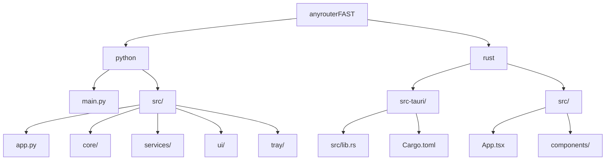

# AnyRouter FAST

> 中转站端点优选工具 - 自动测速、智能切换、hosts 绑定

## 项目愿景

AnyRouter FAST 是一款面向需要访问中转站服务的用户设计的桌面工具。它通过并发测试多个中转站端点的 HTTPS 延迟，自动选择最优 IP 并写入系统 hosts 文件，实现稳定低延迟的访问体验。

**核心能力**:
- 多端点并发延迟测试
- Cloudflare IP 优选（自动识别 + 自定义 IP 列表）
- 一键/自动绑定 hosts
- 支持手动模式与自动模式（定时检测 + 智能切换）

## 架构总览

本项目提供两套并行实现:

| 版本 | 技术栈 | 状态 | 特点 |
|------|--------|------|------|
| Python 版 | CustomTkinter + pystray | 完整 | 开发便捷，依赖少 |
| Rust 版 | Tauri + React + TailwindCSS | 完整 | 性能优越，体积小 |

两套实现功能完全对等，共享相同的业务逻辑:

```
[用户界面] <-> [测速引擎] <-> [hosts 管理器]
                  |
            [端点测试器]
                  |
            [Cloudflare IP 优选]
```

## 模块结构图



## 模块索引

| 模块 | 路径 | 职责 | 入口文件 |
|------|------|------|----------|
| Python GUI | `python/` | CustomTkinter 桌面应用 | `python/main.py` |
| Rust/Tauri | `rust/` | Tauri + React 桌面应用 | `rust/src-tauri/src/main.rs` |

## 运行与开发

### Python 版

```bash
cd python

# 安装依赖
pip install -r requirements.txt

# 运行（需要管理员权限以修改 hosts）
python main.py
```

**依赖**: customtkinter, pystray, Pillow

### Rust/Tauri 版

```bash
cd rust

# 安装前端依赖
npm install

# 开发模式
npm run tauri dev

# 构建发布版
npm run tauri build
```

**依赖**: Rust 1.70+, Node.js 18+, npm

## 测试策略

> 当前状态: 两套实现均无自动化测试

**推荐补充**:
- Python: pytest + pytest-asyncio 测试 endpoint_tester
- Rust: cargo test 测试 endpoint_tester 和 hosts_manager

## 编码规范

### Python
- 使用 dataclass 定义数据模型
- 类型注解（typing 模块）
- 线程安全：使用 threading.Lock 保护共享状态
- 事件驱动：通过 queue.Queue 进行 UI 与引擎通信

### Rust
- 异步运行时: tokio
- 错误处理: thiserror 定义领域错误
- 序列化: serde + serde_json
- TLS: tokio-rustls + webpki-roots

### TypeScript/React
- 函数组件 + Hooks
- 类型定义集中在 `src/types/index.ts`
- 样式: TailwindCSS

## AI 使用指引

### 常见任务

1. **添加新端点**
   - Python: 修改 `python/src/core/models.py` 的 `DEFAULT_ENDPOINTS`
   - Rust: 修改配置文件或 UI 添加

2. **修改测速逻辑**
   - Python: `python/src/services/endpoint_tester.py`
   - Rust: `rust/src-tauri/src/endpoint_tester.rs`

3. **调整 UI 布局**
   - Python: `python/src/ui/views/` 下的各视图文件
   - Rust: `rust/src/components/` 下的 React 组件

### 注意事项

- hosts 操作需要管理员权限（Windows）
- Cloudflare IP 优选仅在检测到 CF 网络时生效
- 配置文件位置:
  - Python: `%APPDATA%/AnyRouter/config.json`
  - Rust: `%APPDATA%/com.anyrouter/fast/config.json`

## 变更记录 (Changelog)

### 2026-01-28
- 初始化项目文档
- 扫描完成 Python 和 Rust 两套实现
- 生成模块级 CLAUDE.md
